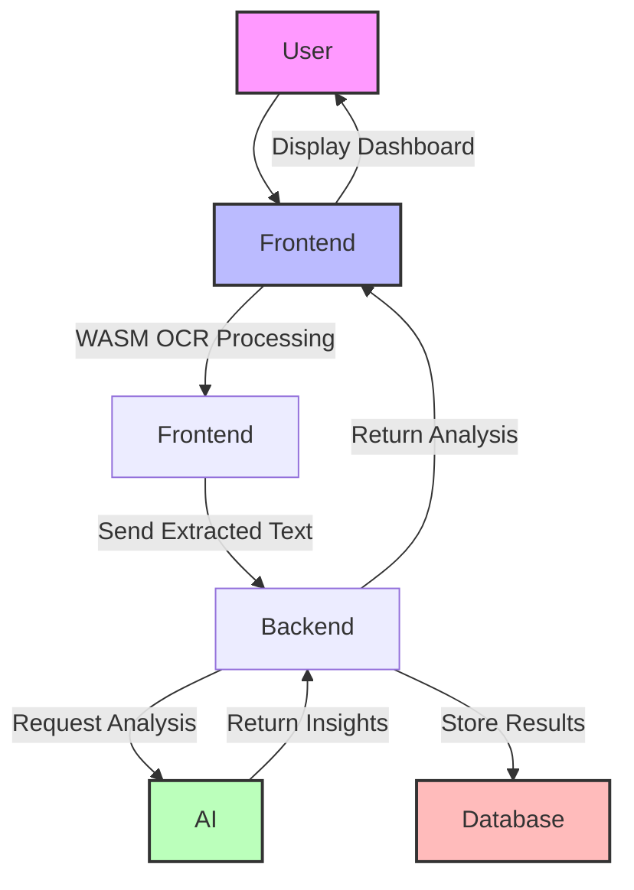

# AI-Powered Document Processing & Analysis System


## 📖 Overview

An end-to-end system for processing and analyzing documents using AI/ML technologies. Handles contracts, invoices, and reports with secure browser-based processing.

## ✨ Key Features

- 🖥️ Browser-based OCR with WebAssembly
- 🧠 AI-powered insights using GPT & custom NLP models
- 🔒 Secure client-side document processing
- 📊 Real-time analytics dashboard
- 🚀 Scalable microservices architecture

## 🛠 Tech Stack

**Backend**  


**Frontend**  


**AI/ML**  


**Infrastructure**  


## 📦 Installation

```bash
# Clone repository
git clone https://github.com/yourusername/ai-doc-processing.git
cd ai-doc-processing

# Install dependencies
npm install

# Setup environment variables
cp .env.example .env

# Start services
docker-compose -f infrastructure/docker-compose.yml up -d

# Build AI components
cd packages/ai-core/ocr-engine
wasm-pack build --target web --out-dir ../../../apps/client/public/wasm

# Run migrations
npm run migration:run

# Start development servers
npm run dev


## 🚀 Usage
Access the web interface at http://localhost:3000

Upload documents (PDF, PNG, JPG)

View real-time analysis results

Explore insights in the dashboard

```bash
# Example API request
curl -X POST http://localhost:3000/api/documents/process \
  -H "Content-Type: application/json" \
  -d '{"content": "Base64EncodedDocument", "mimeType": "application/pdf"}'
```


## 🌐 API Reference
Endpoint	Method	Description
/api/documents	POST	Upload and process document
/api/documents/{id}	GET	Retrieve processed document
/api/insights	GET	Get aggregated analytics


## 🔄 System Flow


